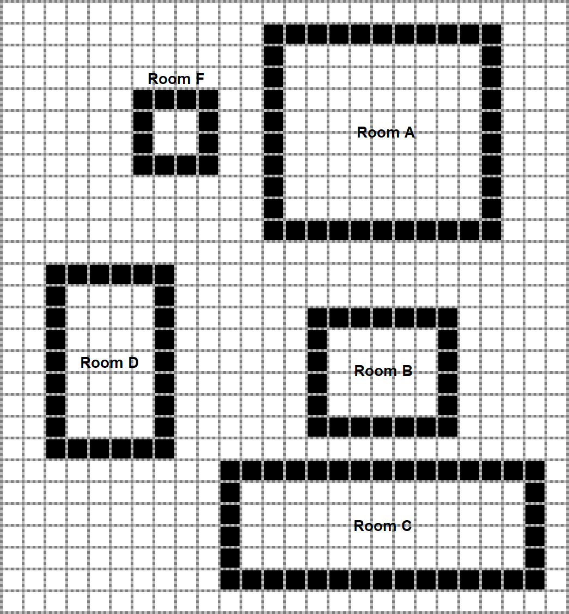
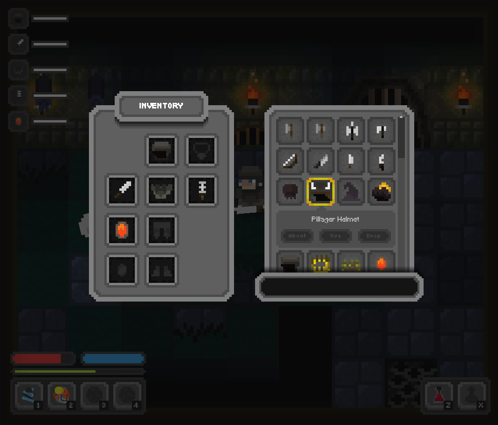

# PocketDungeon_Unity3D_2D_game
## Description
Unity3D rouge like 2D game project with procedural generation.

### WorldGen

### Quick preview

#### Simple combat

#### Simple combat 2

#### New enemy - bat

### Screenshots
#### Main menu screen

#### New Game screen

#### Load Game screen

#### Option screen

#### Game screen

#### In-game menu screen

#### Attribute screen

#### Inventory screen

#### Item Info screen

#### Resource screen

#### Building screen

#### Map screen

## Original Concept art for project (Deprecated)
- Link to Figma project design: https://www.figma.com/proto/DMoUBiK9zdIY0Xcdcq4oA0/PocketDungeonProject?node-id=40%3A22&viewport=-23044%2C631%2C12.507408142089844&scaling=contain
## Goals
- Maze like map generation
- Procedural room generation
- NEET GNN AI
- Multiplayer
- Original art
